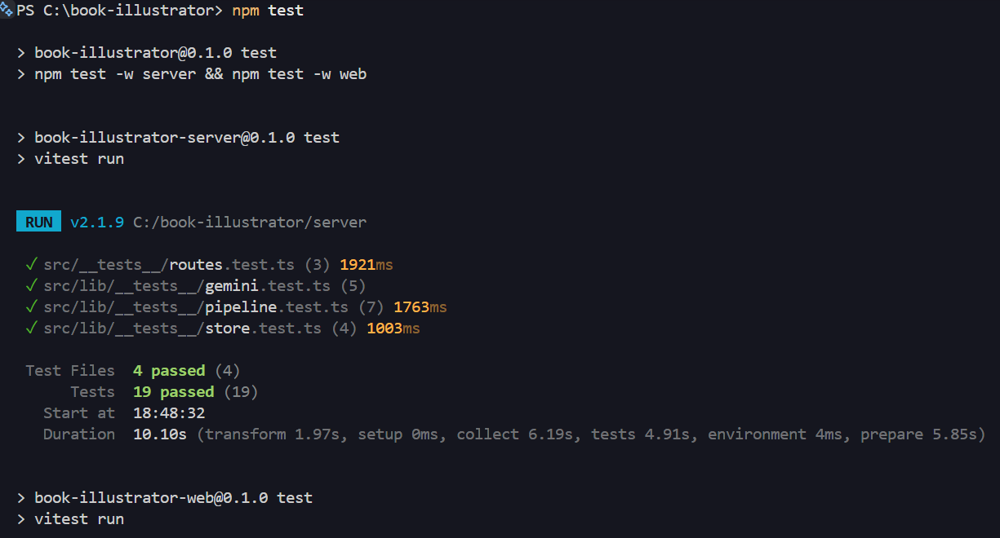
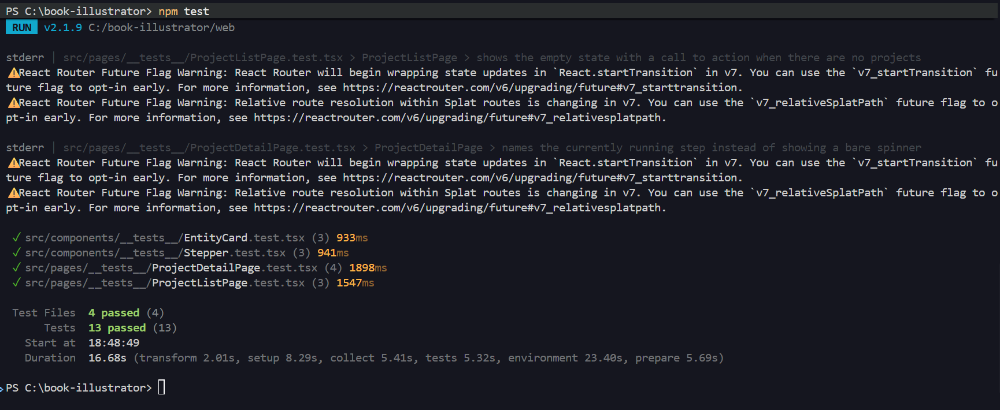

# Testing

## Strategy

**Backend** (`server/`, Vitest): focused on the logic the spec grades most
heavily — step ordering, progress modeling, and retry/concurrency — not on
re-testing Express or Node's `fs`.

- `pipeline.test.ts`: step ordering enforcement (can't run a step out of
  order), the full happy path with the 2-character/1-chapter caps asserted,
  user-supplied style skipping the Gemini style call, the duplicate-call
  guard (two concurrent `startStep` calls → exactly one succeeds), the
  orphan/stuck-step detection and recovery path, and failure leaving a step
  retryable without touching completed steps. The Gemini client is mocked
  (`vi.mock('../gemini.js')`) — no real network calls, and the mock's
  resolve/reject timing is what makes the concurrency tests deterministic.
- `gemini.test.ts`: the REST client in isolation, with `global.fetch`
  mocked. Specifically checks that the 2/1 caps are enforced by truncating
  the parsed response even when the (mocked) API returns more than the cap
  — the thing the spec calls out as a hard requirement to check
  server-side, not just trust the prompt to produce.
- `store.test.ts`: user upsert-by-email, project isolation per user, and
  that concurrent `updateProject` calls serialize instead of losing writes
  (the concurrency guarantee storage is supposed to provide at this scope).
- `routes.test.ts`: the same mocked-Gemini happy path as `pipeline.test.ts`,
  but driven through real HTTP requests (`supertest` against the Express
  `app` exported from `app.ts`) instead of calling `startStep()` directly —
  covers the wiring `pipeline.test.ts` can't see: login → create project →
  run all 5 steps → fetch a generated image through `/api/files`, plus the
  duplicate-run guard and ownership check (401 with no session, 404 for a
  project owned by a different user) at the routes layer specifically.

**Frontend** (`web/`, Vitest + React Testing Library): a handful of
components/states that matter, not exhaustive coverage, per the spec's own
steer ("pick a couple that matter; don't test everything").

- `Stepper.test.tsx`: done/current/pending rendering across a few
  representative statuses — the piece of UI every screenshot in the spec
  leans on being correct.
- `EntityCard.test.tsx`: the three states a portrait/illustration card can
  be in (pending / generating / done) — this is the "per-item progress
  while images generate" requirement made visible.
- `ProjectListPage.test.tsx`: empty state with its call-to-action, status
  pills (including the "interrupted, needs retry" case), and the
  load-failure-with-retry state.
- `ProjectDetailPage.test.tsx`: the in-progress state naming the specific
  running step (not a bare spinner), the failed state with a same-step
  retry button, the stuck/orphaned-step recovery banner, and the initial
  loading state. These four map directly to the spec's required screens.

`api.ts` is mocked in every page test (`vi.mock('../../lib/api')`) — no real
HTTP in a component test.

## Deliberately not tested

- **E2E** — explicitly not expected per the spec.
- **Real Gemini calls in the automated suite** — every automated test mocks
  the client/`fetch`; nothing there burns quota. A real key *was* exercised
  manually afterward (not as part of `./test.sh`): it caught two real bugs
  in the initial REST-shape mapping (a nonexistent `output_text` field, and
  `image/png` being rejected in favor of `image/jpeg`), both fixed and
  covered by a regression test in `gemini.test.ts`. Style and Characters are
  confirmed working end-to-end against live Gemini calls; Portraits and
  Illustrations are blocked on the key used for testing by a `429`/quota-0
  response for every image model tried — see `DECISIONS.md` and
  `docs/architecture.md`.
- **Visual/CSS regressions** — judged by eye against `app-demo.html`, not
  automated.

## Test report (real run)

Produced by `./test.sh` (root `npm test`, which runs `npm test -w server`
then `npm test -w web`):

```
> book-illustrator-server@0.1.0 test
> vitest run

 ✓ src/lib/__tests__/gemini.test.ts (5 tests) 149ms
 ✓ src/lib/__tests__/store.test.ts (4 tests) 717ms
 ✓ src/lib/__tests__/pipeline.test.ts (7 tests) 1260ms
 ✓ src/__tests__/routes.test.ts (3 tests) 1441ms

 Test Files  4 passed (4)
      Tests  19 passed (19)
   Start at  18:40:55
   Duration  7.32s

> book-illustrator-web@0.1.0 test
> vitest run

 ✓ src/components/__tests__/EntityCard.test.tsx (3 tests) 475ms
 ✓ src/components/__tests__/Stepper.test.tsx (3 tests) 460ms
 ✓ src/pages/__tests__/ProjectListPage.test.tsx (3 tests) 829ms
 ✓ src/pages/__tests__/ProjectDetailPage.test.tsx (4 tests) 1033ms

 Test Files  4 passed (4)
      Tests  13 passed (13)
   Start at  18:41:17
   Duration  124.38s
```

32/32 passing (19 backend, 13 frontend). Screenshots of this run:




The backend suite was run 12
consecutive times early on to confirm a Windows-specific race (`EPERM` on
concurrent file rename, see `DECISIONS.md`) was actually fixed rather than
coincidentally not reproducing — flagging that here since a single green
run wouldn't have caught it either.
